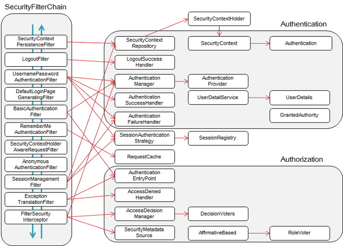
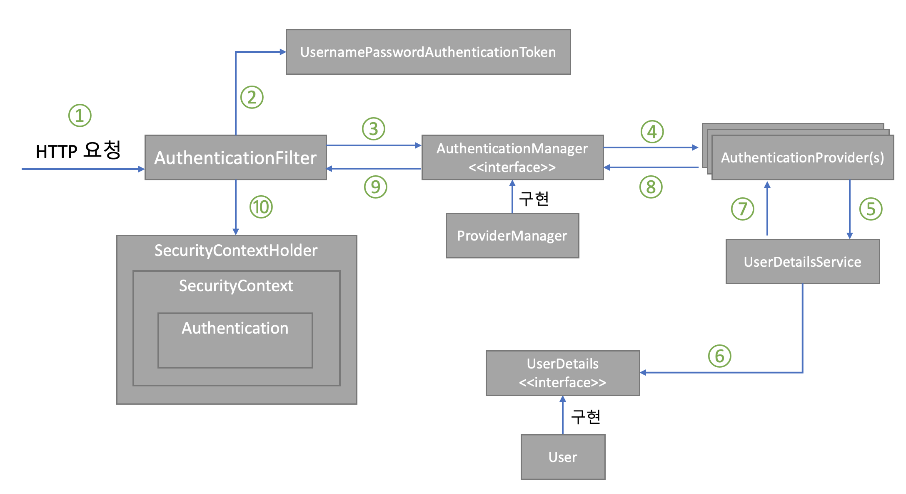

# 스프링 시큐리티
스프링 기반의 애플리케이션 보안(인증, 인가, 권한)을 담당하는 스프링 하위 프레임워크

### 인증과 인가 Authentication & Authorization
1. 인증 authentication : 사용자의 신원을 입증하는 과정      
ex. 사용자가 사이트에 로그인을 할 때 누구인지 확인하는 과정
2. 인가 authorization : 사이트의 특정 부분에 접근할 수 있는지 권한을 확인하는 작업   
ex. 관리자 - 관리자 페이지 접근 가능, 일반 사용자 - 관리자 페이지 접근 불가

### 스프링 시큐리티
- 스프링 기반 애츨리케이션의 보안을 담당하는 스프링 하위 프레임워크   
- 보안 관련 옵션 제공, 애너테이션으로 설정하기 쉬움
- CSRF 공격, 세션 고정 공격 방어, 요청 헤더 보안처리




- UsernamePasswordAuthenticationFilter   
아이디와 패스워드가 넘어오면 인증 요청을 위임하는 인증 관리자
- FilterSecurityInterceptor   
권한 부여 처리를 위임해 접근 제어 결정을 쉽게 하는 접근 결정 관리자

| 필터명                                     | 설명                                                                                                                                                        |
|:----------------------------------------|:----------------------------------------------------------------------------------------------------------------------------------------------------------|
| SecurityContextPersisenceFilter         | SecurityContextRepository에서 SecurityContext(접근 주체와 인증에 대한 정보를 담고 있는 객체)를 가져오거나 저장하는 역할                                                                    |
| LogoutFilter                            | 설정된 로그아웃 URL로 오는 요청을 확인해 해당 사용자를 로그아웃 처리한다                                                                                                                |
| UsernamePasswordAuthenticationFilter    | 인증 관리자<br/>폼 기반 로그인을 할 떄 사용되는 필터로 아이디, 패스워드 데이터를 파싱해 인증 요청을 위임한다<br/>인증이 성공하면 AuthenticationSuccessHandler를, 인증에 실패하면 AuthenticationFailureHandler를 실행한다. |
| DefaultLoginPageGeneratingFilter        | 사용자가 로그인 페이지를 따로 지정하지 않았을 때 기본으로 설정하는 로그인 페이지 관련 필터                                                                                                       |
| BasicAuthenticationFilter               | 요청 헤더에 있는 아이디와 패스워드를 파싱해서 인증 요청을 위임한다<br/>인증에 성공하면 AuthenticationSuccessHandler를, 인증에 실패하면 AuthenticationFailureHandler를 실행한다                             |
| RequestCacheAwareFilter                 | 로그인 성공 후, 관련 있는 캐시 요청이 있는지 확인하고 캐시 요청을 처리해준다<br/>예를 들어 로그인하지 않은 상태로 방문했던 페이지를 기억해두었다가 로그인 이후에 그 페이지로 이동 시켜준다.                                             |
| SecurityContextHolderAwareRequestFilter | HttpServletRequest 정보를 감싼다<br/>필터 체인 상의 다음 필터들에게 부가 정보를 제공되기 위해 사용한다.                                                                                     |
| AnonymousAuthenticationFilter           | 필터가 호출되는 시점까지 인증되지 않았다면 익명 사용자 전용 객체인 AnonymousAuthentication을 만들어 SecurityContext에 넣어준다.                                                                 |
| SessionManagementFilter                 | 인증된 사용자와 관련된 세션 관련 작업을 진행한다<br/>세션 변조 방지 전략을 설정하고, 유효하지 않은 세션에 대한 처리를 하고, 세션 생성 전략을 세우는 등의 작업을 처리한다.                                                      |
| ExceptionTranslationFilter              | 요청을 처리하는 중에 발생할 수 있는 예외를 위임하거나 전달한다.                                                                                                                      |
| FilterSecurityInterceptor               | 접근 결정 관리자<br/>AccessDecisionManager로 권한 부여 처리를 위임함으로써 접근 제어 결정을 쉽게 해준다<br/>이 과정에서는 이미 사용자가 인증되어 있으므로 유효한 사용자인지도 알 수 있다 (인가 관련 설정 가능)                      |


#### 스프링 시큐리티 인증 절차


```text
1. 사용자가 폼에 아이디와 패스워드를 입력 &rarr; HTTPServletRequest에 아이디와 비밀번호가 전달된다.   
이 때 AuthenticationFilter가 넘어온 아이디와 비밀번호의 유효성 검사를 수행한다.
2. 유효성 검사가 끝나면, 실제 구현체인 UsernamePasswordAuthenticationToken을 만들어 넘겨준다.
3. 전달받은 인증용 객체 UsernamePasswordAuthenticationToken을 AuthenticationManager에게 보낸다.
4. UsernamePasswordAuthenticationToken을 AuthenticationProvider에 보낸다.
5. 사용자 아이디를 UserDetailService에 보낸다.   
UserDetailService : 사용자 아이디로 찾은 사용자의 정보를 UserDetails 객체로 만들어 AuthentiationProvider에게 전달한다.
6. DB에 있는 사용자 정보를 가져온다.
7. 입력 정보와 UserDetails의 정보를 비교해 실제 인증 처리를 한다.
8. ~ 10. 까지 인증이 완료되면 SecurityContextHolder에 Authentication을 저장한다.   
인증 성공 여부에 따라 성공하면 AuthenticationSuccessHandler, 실패하면 AuthenticationFailureHandler 핸들러를 실행한다.
```

#### 인증 정보를 위한 오버라이드 메서드

| 메서드                       | 반환 타입                                  | 설명                                                                                 |
|:--------------------------|:---------------------------------------|:-----------------------------------------------------------------------------------|
| getAuthorities()          | Collection<? extends GrantedAuthority> | 사용자가 가지고 있는 권한의 목록 반환<br/>예제에서는 사용자 이외의 권한이 없기 때문에 user 권한만 담아 반환한다                |
| getUsername()             | String                                 | 사용자를 식별할 수 있는 사용자 이름 반환<br/>이때 사용되는 사용자 이름은 반드시 고유해야 한다. 예제에서는 유니크 속성이 적용된 이메일을 반환 |
| getPassword()             | String                                 | 사용자의 비밀번호 반환<br/>저장되어 있는 비밀번호는 암호화해서 저장해야 한다                                       |
| isAccountNonExpired()     | boolean                                | 계정이 만료되었는지 확인하는 메서드<br/> 만료되지 않았으면 true 반환                                         |
| isAccountNonLocked()      | boolean                                | 계정이 잠금되었는지 확인하는 메서드<br/> 잠금되지 않았으면 true 반환                                         |
| isCredentialsNonExpired() | boolean                                | 비밀번호가 만료되었는지 확인하는 메서드<br/> 만료되지 않았으면 true 반환                                       |
| isEnabled()               | boolean                                | 계정이 사용 가능한지 확인하는 메서드<br/> 사용 가능하다면 true 반환                                         |
