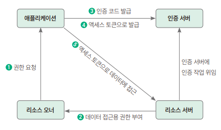

# OAuth
> 제3의 서비스에 계정 관리를 맡기는 방식

**OAuth 용어정리**
```text
* 리소스 오너 resource owner
    자신의 정보를 사용하도록 인증 서버에 허가하는 주체 (=서비스를 이용하는 사용자)
* 리소스 서버 resource server
    리소스 오너의 정보를 가지며, 리소스 오너의 정보를 보호하는 주체 (=네이버, 구글, 페북 등)

* 인증 서버 authorization server
    클라이언트에게 리소스 오너의 정보에 접근할 수 있는 토큰을 발급하는 역할을 하는 애플리케이션
* 클라이언트 애플리케이션 client application
    인증 서버에게 인증을 받고, 리소스 오너의 리소스를 사용하는 주체 (=만드는 서비스)
```
> OAuth를 사용하면 인증 서버에서 발급받은 토큰을 사용하여 리소스 서버에 리소스 오너의 정보를 요청하고 응답받아 사용할 수 있다

**리소스 오너 정보 취득 4가지 방법**
```text
1. 권한 부여 코드 승인 타입 (authorization code grant type)
  - OAuth 2.0에서 가장 잘 알려진 인증 방법
  - 클라이언트가 리소스에 접근하는 데 사용, 권한에 접근할 수 있는 코드와 리소스 오너에 대한 액세스 토큰을 발급받는 방식
2. 임시적 승인 타입 (implict grant type)
  - 서버가 없는 자바스크립트 웹 애플리케이션 클라이언트에서 주로 사용하는 방법
  - 클라이언트가 요청을 보내면 리소스 오너의 인증 과정 이외에는 권한 코드 교환 등의 별다른 인증 과정을 거치지 않고 액세스 토큰을 제공받는 방식
3. 리소스 소유자 암호 자격증명 승인 타입 (resource owner password credentials)
  - 클라이언트의 패스워드를 이용해서 액세스 토큰에 대한 사용자의 자격 증명을 교환하는 방식
4. 클라이언트 자격증명 승인 타입 (client credentials grant)
  - 클라이언트가 컨텍스트 외부에서 액세스 토큰을 얻어 특정 리소스에 접근을 요청할 때 사용하는 방식
```

### 권한 부여 코드 승인 타입


1. 권한요청  
스프링 부트 서버가 특정 사용자 데이터에 접근하기 위해 권한 서버 (카카오, 구글 등)에 요청을 보내는 것  
클라이언트 ID, 리다이렉트 URI, 응답 타입
    ```text
    client_id
    인증 서버가 클라이언트에 할당한 고유 식별자. 클라이언트 애플리케이션을 OAuth 서비스에 등록할 때 서비스에서 생성하는 값
    
    redirect_uri
    로그인 성공 시 이동해야 하는 URI
    
    response_type
    클라이언트가 제공받기 원하는 응답 타입
    
    scope
    제공받고자 하는 리소스 오너의 정보 목록
   
   client_secret
   OAuth 서비스에 등록할 때 제공받는 비밀키
   
   grant_type
   권한 서버는 요청 값을 기반으로 유효한 정보인지 확인, 유효한 정보라면 액세스 토큰으로 응답한다
    ```

2. 데이터 접근용 권한 부여  
인증 서버에 요청을 최초로 보내는 경우 사용자에게 보이는 페이지를 로그인 페이지로 변경하고 사용자 데이터 접근 동의를 얻는 과정   
최초 1회만 진행, 동의하면 인증서버에 동의내용을 저장하고 있어 로그인만 진행됨  
로그인 성공 시 권한 부여 서버는 데이터에 접근할 수 있게 인증 및 권한 부여 수신


3. 인증 코드 제공  
사용자 로그인 성공할 때 파라미터로 보낸 redirect_uri로 리다이렉션  
파라미터에 인증 코드 함께 제공됨


4. 액세스 토큰 응답  
인증 코드를 받으면 액세스 토큰으로 교환해야 함  
로그인 세션에 대한 보안자격을 증명하는 식별 코드

   
5. 액세스 토큰으로 API 응답 & 반환   
제공받은 액세스 토큰으로 리소스 오너의 정보를 가져올 수 있다   
정보가 필요할 때마다 API 호출을 통해 정보를 가져오고 리소스 서버는 토큰이 유효한지 검사 후 응답한다